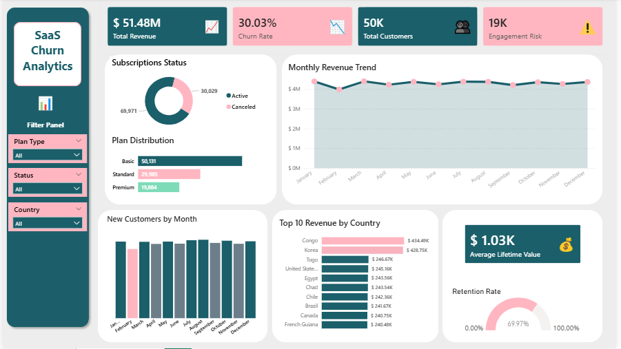

# SaaS Churn & Revenue Analytics

## Overview
Churn is one of the most critical metrics in any subscription business, yet most analyses stop at cancellations. This project takes a deeper approach by identifying three distinct layers of customer risk: financial churn, engagement churn, and silent churn.

The analysis covers:
- 50,000 customers
- 100,000 subscriptions
- 500,000 transactions

All insights are visualised in an interactive dashboard built in Microsoft Power BI using data prepared in MySQL.

## Tools & Technologies
- MySQL - data storage and transformation
- Microsoft Power BI - dashboard and visual analytics

## Business Questions
This analysis addresses several key business questions:
- What is the true state of the subscription base?
- How many customers have churned and what is the revenue impact?
- Which active subscribers are disengaged and at risk of cancelling?
- What is the lifetime value of each customer?
- How can customers be segmented by financial health and engagement?

## Dashboard


## Key Findings

**Financial Churn**
30% of subscriptions have churned. The customer classification model identifies exactly who they are, enabling the business to analyse common patterns and build an early warning system before the next wave cancels.

**Engagement Risk**
19,000 active subscribers have not logged in for 90 or more days. These customers are the highest-priority re-engagement target. They are still paying but already disengaged, making them the most likely next wave of cancellations. A targeted outreach campaign here costs far less than acquiring a replacement customer.

**Silent Churn**
A segment of active subscribers shows no feature usage in 90 or more days. This signals a product adoption failure, not a pricing problem. The intervention is better onboarding and feature education, not discounting.

**Upsell Opportunity**
More than 50,000 customers are on the Basic plan against only 19,884 on Premium. Engaged Basic subscribers represent the highest-probability upgrade candidates. Converting even a small fraction to Standard or Premium generates compounding revenue without acquiring a single new customer.

## Methodology
All time-based calculations use a dynamic reference date derived from the dataset rather than hardcoded values:

```sql
WITH reference_date AS (
    SELECT MAX(COALESCE(end_date, start_date)) AS report_date
    FROM subscriptions
)
```

This ensures the analysis remains fully reproducible as new data is added.

### Churn Classification Model
The analysis distinguishes between three types of churn, which are often conflated in traditional reporting:

| Churn Type | Definition |
|---|---|
| Financial Churn | Subscription cancelled or end date passed |
| Engagement Churn | Active subscription but no login for 90+ days |
| Silent Churn | Active subscription but no feature usage for 90+ days |

### Customer Segmentation
Every customer is classified into one of three segments:
- Active - engaged and financially healthy
- Engagement Risk - active but disengaged
- Financial Churn - subscription cancelled

This segmentation allows the business to identify at-risk customers earlier and intervene before revenue is lost.

## Business Implications
Three actions follow directly from this analysis. First, the 19,000 engagement-risk customers should be prioritised for re-engagement campaigns before they convert to financial churn, intervening here is cheaper than acquiring new customers. Second, the silent churn segment represents product adoption failure, not pricing failure, the fix is onboarding and feature education, not discounting. Third, with over 50,000 customers on Basic, a targeted upsell motion toward engaged lower-tier subscribers is the highest-leverage revenue opportunity available without adding a single new customer.
